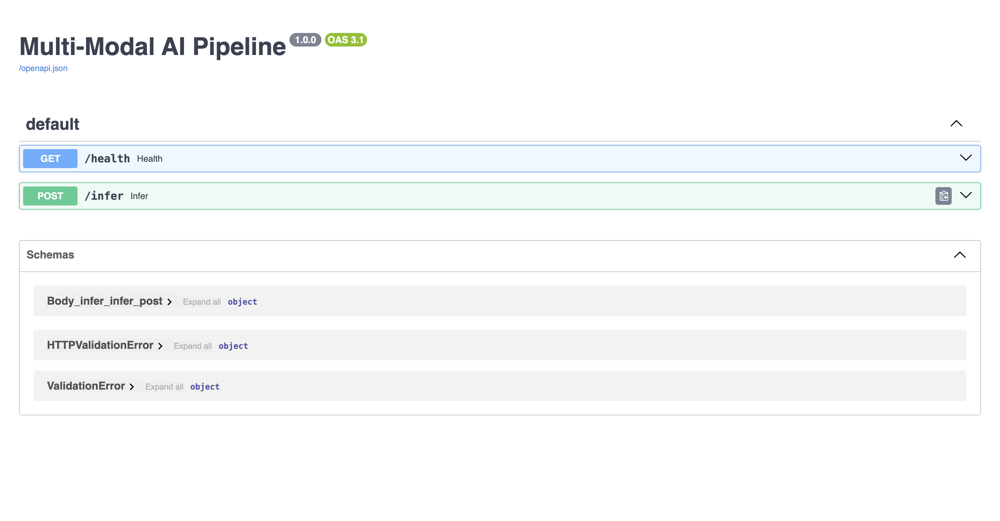

# Multi-Modal AI + NLP + MLOps Pipeline

End-to-end implementation of all four Project Nexus assessment challenges:

| Challenge | Weight | Core Technologies |
|---|---|---|
| 1. Multi-Modal Inference Pipeline | 30% | OpenCV, MediaPipe, spaCy, NLTK, TensorFlow/Keras, MySQL |
| 2. Transformer-Driven Sentiment Analysis | 20% | DistilBERT, Custom LSTM (PyTorch), scikit-learn |
| 3. Production-Grade MLOps Simulation | 20% | Docker, AWS/GCP/Azure deployment strategies |
| 4. Data Engineering for Scale | 30% | Pandas, NumPy, SQL indexing, Parquet |

## Interface



## Project Structure

```
├── src/
│   ├── app.py                          # FastAPI service entrypoint
│   ├── config.py                       # Environment-based settings
│   ├── pipeline/
│   │   └── multimodal_service.py       # Unified inference orchestration
│   ├── vision/
│   │   └── feature_extractor.py        # OpenCV + MediaPipe feature extraction
│   ├── nlp/
│   │   └── text_processor.py           # spaCy tokenization + NLTK VADER sentiment
│   ├── models/
│   │   └── image_classifier.py         # Pre-trained MobileNetV2 classifier
│   ├── db/
│   │   └── mysql_client.py             # MySQL persistence with raw SQL queries
│   ├── sentiment/
│   │   ├── rnn_baseline.py             # Custom LSTM baseline (Keras)
│   │   ├── transformer_model.py        # DistilBERT fine-tuning wrapper
│   │   └── compare.py                  # Side-by-side comparison runner
│   └── data/
│       └── ingestion.py                # Pandas/NumPy data cleaning pipeline
├── scripts/
│   ├── run_sentiment_comparison.py     # Challenge 2 runner (requires TensorFlow)
│   ├── run_comparison_standalone.py    # Challenge 2 runner (PyTorch-only)
│   ├── run_ingestion.py                # Challenge 4 runner
│   └── sql_indexing.py                 # Standalone MySQL schema/index bootstrapper
├── tests/
│   ├── conftest.py                    # Pytest import bootstrap
│   ├── test_ingestion.py              # Ingestion and SQL index tests
│   └── test_mysql_client.py           # MySQL helper test
├── data/
│   ├── sample_reviews.csv              # 300 labeled reviews (positive/neutral/negative)
│   ├── noisy_dataset.csv               # Dirty dataset for ingestion testing
│   └── processed/                      # Cleaned output (gitignored)
├── schemas/
│   └── schema.sql                      # MySQL schema + CREATE INDEX statements
├── Dockerfile                          # Containerized Challenge 1 service
├── REPORT.md                           # Challenge 2 results + Challenge 4 scaling strategy
├── DEPLOYMENT.md                       # AWS, GCP, Azure migration playbook
├── requirements.txt                    # Python dependencies
├── .python-version                     # Project Python interpreter pin (3.11)
├── .env.example                        # Environment variable template
├── ui_screenshot.png                   # Screenshot of the UI
└── .gitignore
```

## Setup

Python version:

- Full stack (including TensorFlow/Keras baseline): Python 3.11
- Python 3.12+ can run non-TensorFlow flows (for example `run_comparison_standalone.py`)

## Code Quality

The codebase follows PEP 8-style conventions and has been validated with Ruff for consistent formatting and linting.

### 1) Create virtual environment

```bash
python3.11 -m venv .venv
source .venv/bin/activate
```

### 2) Install dependencies

```bash
pip install -r requirements.txt
python -m spacy download en_core_web_sm
```

Optional test tooling:

```bash
pytest
```

### 3) Configure environment

```bash
cp .env.example .env
# Edit .env with your MySQL credentials
```

### 4) Prepare database

```bash
python scripts/sql_indexing.py
```

This creates the `multimodal_ai` database, the `inference_results` table, and all indexes.
The schema is safe to re-run; existing indexes are detected and skipped.

Optional fallback (if you prefer running SQL directly):

```bash
set -a
source .env
set +a
mysql -h "$MYSQL_HOST" -P "$MYSQL_PORT" -u "$MYSQL_USER" -p"$MYSQL_PASSWORD" < schemas/schema.sql
```

---

## Challenge 1 — Multi-Modal Inference Service

Start the FastAPI server:

```bash
python -m uvicorn src.app:app --reload --host 127.0.0.1 --port 8000
```

### Endpoints

| Method | Path | Description |
|---|---|---|
| `GET` | `/health` | Liveness check + database connectivity |
| `POST` | `/infer` | Combined image + text inference |

### Example request

```bash
curl -X POST "http://127.0.0.1:8000/infer" \
  -F "image=@data/test_image.jpg" \
  -F "query=Is this scene positive or negative?"
```

The response includes:
- **Image classification** (MobileNetV2 ImageNet label + confidence)
- **Visual features** (face count, edge density, brightness)
- **Text analysis** (tokens, lemmas, noun phrases, VADER sentiment)
- **Combined summary** merging all outputs
- Results are persisted to MySQL via raw SQL `INSERT` queries

---

## Challenge 2 — Transformer vs RNN Comparison

Run the standalone comparison (no TensorFlow required):

```bash
python scripts/run_comparison_standalone.py
```

Or if TensorFlow is installed:

```bash
python scripts/run_sentiment_comparison.py
```

Both scripts train a **custom LSTM** (random initialization) and fine-tune **DistilBERT** on `data/sample_reviews.csv`, then output accuracy and macro-F1 for each.

Note: the message about some DistilBERT classifier weights being newly initialized is expected during fine-tuning and is not an error.

**Measured results and analysis** → see [`REPORT.md`](REPORT.md)

---

## Challenge 3 — Docker & Cloud Deployment

Prerequisite: install Docker Desktop (or another compatible Docker engine) so the `docker` CLI is available.

Build and run the containerized service:

```bash
docker build -t multimodal-mlops-pipeline:latest .
docker run --rm -p 8000:8000 \
  --add-host=host.docker.internal:host-gateway \
  -e MYSQL_HOST=host.docker.internal \
  --env-file .env \
  multimodal-mlops-pipeline:latest
```

**Cloud migration strategies** (AWS, GCP, Azure) with auto-scaling, model versioning, monitoring, and canary deployment → see [`DEPLOYMENT.md`](DEPLOYMENT.md)

---

## Challenge 4 — Data Ingestion Pipeline

Run the cleaning pipeline:

```bash
python scripts/run_ingestion.py
```

Or with custom paths:

```bash
PYTHONPATH=. python -m src.data.ingestion \
  --input data/noisy_dataset.csv \
  --output data/processed/cleaned_dataset.parquet
```

The pipeline handles:
- **Missing values** — drops all-null rows, coerces invalid numerics to NaN
- **Duplicates** — removes exact duplicate rows
- **Type mismatches** — auto-parses timestamps, downcasts numeric types, strips whitespace from text
- **Output** — optimized Parquet format

### SQL Indexing Strategy

Defined in [`schemas/schema.sql`](schemas/schema.sql) and [`scripts/sql_indexing.py`](scripts/sql_indexing.py) with four indexes targeting high-value query patterns:

| Index | Column | Rationale |
|---|---|---|
| `idx_inference_created_at` | `created_at` | Time-range filtering and recent-result lookups |
| `idx_inference_image_label` | `image_label` | Filter by classification output |
| `idx_inference_sentiment_label` | `sentiment_label` | Filter by sentiment class |
| `idx_inference_query_text` | `query_text` (FULLTEXT) | Free-text search across queries |

**Scaling strategy from 1GB to 1TB** → see [`REPORT.md`](REPORT.md)

---

## Documentation Index

| Document | Contents |
|---|---|
| [`REPORT.md`](REPORT.md) | Transformer vs RNN comparison results + 1GB→1TB scaling strategy |
| [`DEPLOYMENT.md`](DEPLOYMENT.md) | AWS, GCP, Azure deployment with auto-scaling, versioning, monitoring |
| [`schemas/schema.sql`](schemas/schema.sql) | Database schema + index definitions |

Author: Muhammad Umer Farooq
